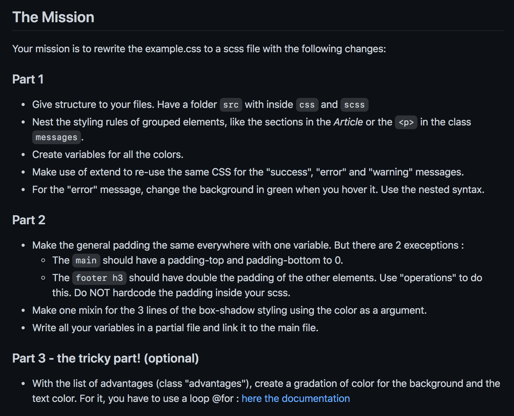

# challenge-sass
Je vais m'initié à SASS.

## Cadre:
Cet exercice est effectué dans le cadre de ma troisième semaine de formation au centre de formation BECODE. 
Nous sommes en janvier 2021.

## Technos utilisées:
HTML5
CSS3
npm

## Auteurs: 
Juste moi :)

## Instructions:
Pour cet exercice le but est de rééecrire un fichier css avec sass.
Délai: 1jour 

## Mission:

## Statut:
Terminé

## Projet déployé: 
Lien Github : https://github.com/RekhaLambotte/challenge-sass.git

Lien web: https://rekhalambotte.github.io/challenge-sass/

## Remarques:
Quelques complications pour installer sass dans le dossier de travail. 
Je suis heureuse d'avoir réussi à tenir le délai (à 1h près).

